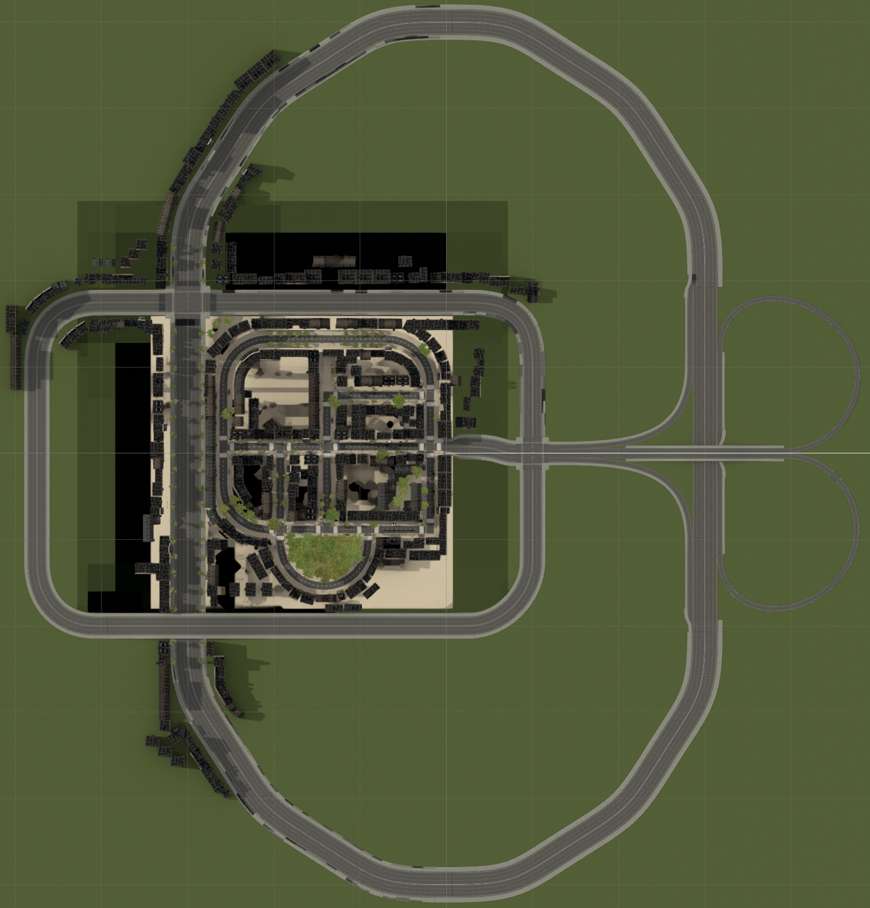
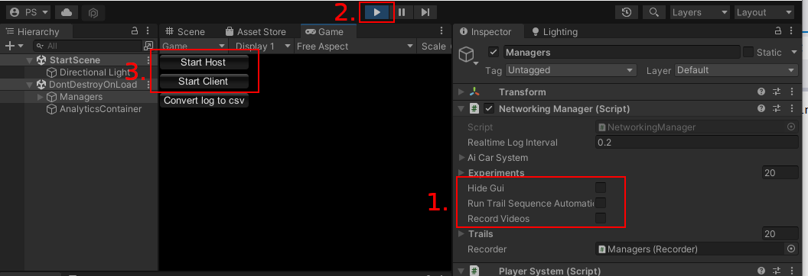
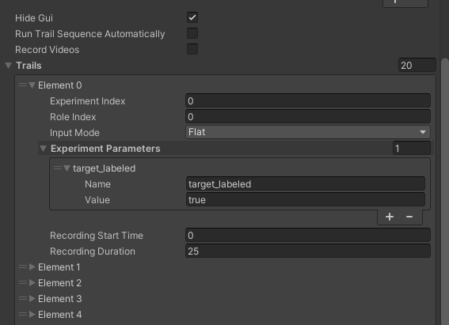
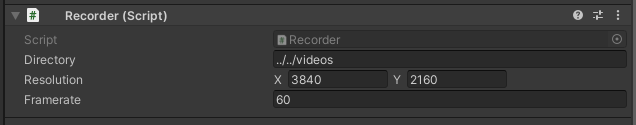
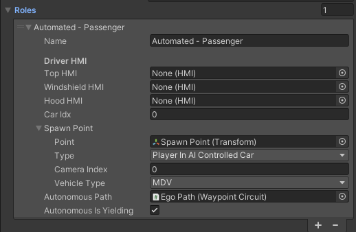
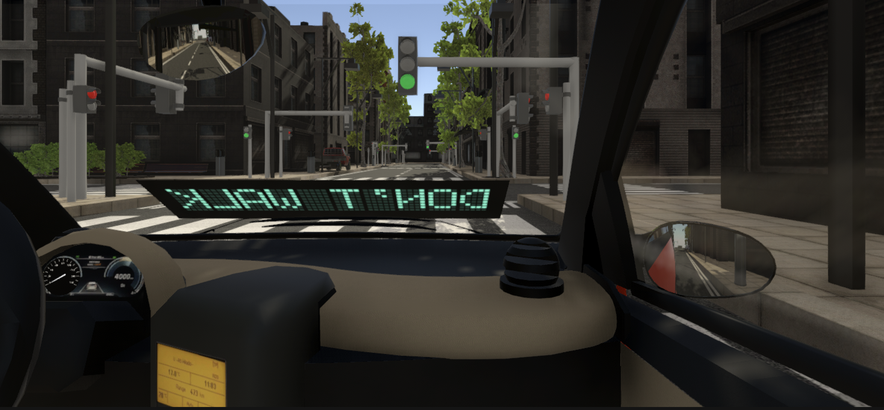
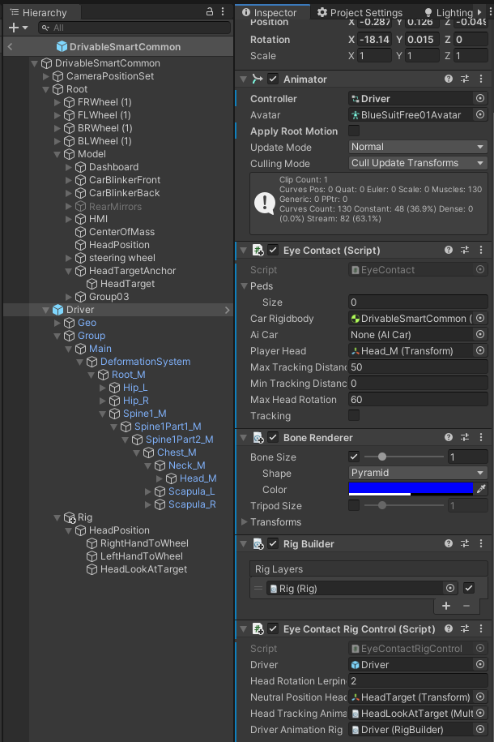

# Coupled simulator for research on driver-pedestrian interactions made in Unity.
## Usage of the simulator
The simulator is open-source and free to use. It is aimed for, but not limited to, academic research. We welcome forking of this repository, pull requests, and any contributions in the spirit of open science and open-source code 😍😄 For enquiries about collaboration, you may contact p.bazilinskyy@tue.nl.

## Citation
If you use the coupled sim for academic work please cite the following paper:

> Bazilinskyy, P., Kooijman, L., Dodou, D., & De Winter, J. C. F. (2020). Coupled simulator for research on the interaction between pedestrians and (automated) vehicles. 19th Driving Simulation Conference (DSC). Antibes, France. 

## Examples of use of the simulator
1. Get out of the way! Examining eHMIs in critical driver-pedestrian encounters in a coupled simulator - [repo](https://github.com/bazilinskyy/coupled-sim-evasive), [paper](https://doi.org/10.1145/3543174.3546849).
1. Stopping by looking: A driver-pedestrian interaction study in a coupled simulator using head-mounted displays with eye-tracking - [paper](http://doi.org/10.1016/j.apergo.2022.103825).

## Description of the simulator
📺 These days, a video is worth more than a million words. The image below points to a YouTube video of the recording of a demo of the simulator with 3 agents:

[](https://www.youtube.com/watch?v=W2VWLYnTYrM)

## Environment


The coupled simulator supports both day and night-time settings. Figure above shows a view of the night mode. Figures below shows the top view of the environment. It is a model of a US-like city containing:
- Network of 2-lane roads.
- Loop of 4-lane road (partially surrounded by buildings).
- Loop of 6-lane road (partially surrounded by buildings).
- Half-clover interchange for the motorway.
- 10 intersections with traffic lights that can be turned on and off before the experiment or programmatically in real-time.
- 34 zebra crossings.
- Static objects (buildings, parked cars, trees).

<!--  -->



### Drivable cars
1. small (similar to Smart Fortwo) - *DrivableSmartCommon* object.
2. medium (similar to Ford Focus 2011) - *DrivableHatchbackCommon* object.
3. medium (similar to Pontiac GTO) - *DrivableFireGTOCommon* object.
4. large (similar to Nissan Datsun) - *DrivableNissanCommon* object.

Cars that are not controlled by the human participants can be instructed to follow a defined trajectory or can be programmed to respond at runtime to other road users. Adding new vehicles can be done by new importing assets (easy).

## Input
The coupled simulator supports a keyboard and a gaming steering wheel as input sources for the driver of the manual car, a keyboard for the passenger of the AV to control the external human-machine interface, and a motion suit or a keyboard for the pedestrian. At the moment, supported motion suit is Xsens Motion Suit.

## Output
The simulator supports giving output to both a computer screen and a head-mounted display (HMD). It has been tested with Oculus Rift CV1, Varjo VR-2 Pro.

## Networking and data logging
The current number of human participants supported by the coupled simulator is four (host and three clients). However, this number can be expanded up to the number of agents supported by the network. Synchronization in a local network is handled by a custom-made network manager designed to support the exchange of information between agents with low latency and real-time data logging at 50 Hz for variables from the Unity environment and up to 700Hz from the motion suit. The data that are logged include the three-dimensional position and rotation of the manual car and the AV, the use of blinkers, high-beam, stop light, and 150 position and angular variables from the motion suit. The data are stored in binary format, and the coupled simulator contains a function to convert the saved data into a CSV file (`Convert log to csv` button in `Play Mode`).

Besides logging data to the binary file, the same set of frame data (in a very similar binary format) is being sent with requested intervals (that can be set with `NetworkingManger.RealtimeLogInterval` property) during the simulation to UDP port 40131 on localhost. The data can be used to monitor the simulation with external tools at runtime. `Tools/log_receiver.py` file contains an example python script that consumes binary data and assembles it into a structure that is easy to interact with. It should be started before starting the simulation with `python log_receiver.py` (with Python 3) from within the `Tools` folder.

The structure of the frame object (with example data) is as follows:
```
{
   "timestamp":1.711700439453125,
   "roundtrip":0.0,
   "Driver [car index]":{ # single integer-indexed entry for a player controlled car avatar
      "position":(-94.58521270751953, -0.056745946407318115, 64.8435287475586),
      "rotation":(0.5252280235290527, 90.8692626953125, 359.9905700683594),
      "blinker":0,
      "front":false,
      "stop":false,
      "rigidbody":(3.1246094703674316, -0.0026992361526936293, -0.046936508268117905)
   },
   "Driver [car index]":{ # multiple integer-indexed entries for each AI-controlled car avatars
      "position":(-112.08060455322266, -0.056995689868927, 21.383098602294922),
      "rotation":(0.5083497762680054, 157.48184204101562, -0.0032447741832584143),
      "blinker":0,
      "front":false,
      "stop":false,
      "rigidbody":(0.5082536935806274, -0.0017757670721039176, -1.2219140529632568),
      "speed":5.904001235961914,
      "braking":false,
      "stopped":false,
      "takeoff":false,
      "eyecontact":false
   },
   "Pedestrian [pedestrian index]":{ # multiple integer-indexed entries for each player or AI-controlled pedestrian avatars
       "bone  [bone index]":{ # multiple integer-indexed entries for each bone of pedestrian rig
          "position":(-94.58521270751953, -0.056745946407318115, 64.8435287475586),
          "rotation":(0.5252280235290527, 90.8692626953125, 359.9905700683594)
       }
   },
   "CarLight [car traffic light index]":{ # multiple integer-indexed entries for each car's traffic light
      "state":"b""\\x00"
   },
   "PedestrianLight [pedestrian traffic light index]":{ # multiple integer-indexed entries for each pedestrain's traffic light
      "state":"b""\\x02"
   },
}
```

The host agent may use `Visual syncing` button to display a red bar across all clients and the host for 1 s to allow for visual synchronization in case screen capture software is used.

## Installation
The simulator was tested on Windows 11 and macOS Ventura 13.5. All functionality is supported by both platforms. However, support for input and output devices was tested only on Windows 10.

After checking out this project, launch Unity Hub to run the simulator with the correct version of Unity (currently **2022.3.5f1**).

## Running a project
 When opening this project for the first time, click `Add` and select your entire downloaded folder containing all the project files. In case you have already used this project before, select the project from the Unity Hub projects list. Wait until the project loads in.

Once the project is loaded into the Unity editor open StartScene scene. You do this by going to the project tab, and clicking on the StartScene icon in the Scenes folder. Now, we will explain three different ways to run scenes, the locations for the first three steps for running as a host or client correlate with the numbers in the picture below. 



### Running simulation as a host
1. Make sure that all three checkboxes (`Hide GUI`, `Run Trial Sequence Automatically`, `Record Videos`) in `NetworkingManager` component on `Managers` game object are unchecked.
2. Press the Play button to run enter `Play Mode`.
3. Once in `Play Mode`, press `Start Host` button. 
4. If needed, wait for clients to join.
5. Once all clients have connected to the host or in case the host is handling the only participant, select one of the experiments listed under `Experiment` section.
6. Assign roles to participants in `Role binding` section. If no role is selected, the participant will run a "headless" mode.
7. Select one of control modes listed under `Mode` section.
8. Start an experiment with the `Initialise experiment` button - all clients will load selected experiment.
9. Once all connected clients are ready - the experiment scene is fully loaded on each client, press `Start simulation` button.

### Running simulation as a client
1. Make sure that all three checkboxes - `Hide GUI`, `Run trial sequence automatically`, `Record videos` (`Managers` (game object) ➡️ `NetworkingManager` (component)), are unchecked.
2. Press the Play button to run enter `Play mode`.
3. Once in `Play Mode`, press `Start client` button.
4. Enter the host IP address. 
5. Press `Connect`.
6. Once connected, select one of control modes listed under `Mode` section.
7. Wait until host starts the simulation.

### Running simulation with multiple agents on one machine
1. Run host agent inside of Unity (as described above).
2. Note the IP address in the console of Unity.
3. Run other  agents after building them `File` ➡️ `Build And Run`. Connect using the IP address from the (1).

Providing input for multiple agents on one machine is not supported. Input is provided only to the agent, the window of which is selected. This mode is intended for testing/debugging.

### Running simulation trials automatically


If the simulation only has one participant that is controlled on a host machine, simulation trials can be set up beforehand and run automatically. It is especially useful when using simulator to record videos for trials which is described in next section. Most of a times user should have any GUI disabled, which can be done by checking `Hide GUI` checkbox. GUI can be enabled at runtime by pressing `Tab` button on the keyboard.

To run simulation trials automatically, both `Run Trial Sequence Automatically` has to be checked and trial sequence has to be set up. Once it is done, press Play button to enter `Play Mode` - first trial in the sequence should start automatically. To finish current trial and either start next one or exit simulator (if currently played trial the last one), press `Escape` button on the keyboard.

In order to set up trial sequence, user has to define entries on the `Trials` list (`StartScene` (scene) ➡️ `Managers` (game object) ➡️ `NetworkingManager` (component) ➡️ `Trials` (click arrow to open the field)). Each entry consists of the following fields:
- `ExperimentIndex`: int variable which indicates a zero-based index of a selected experiment in `Experiments` list (`NetworkingManager` (component) ➡️ `Experiments` (field)).
- `RoleIndex`: int variable which indicates a zero-based index of a selected role in `Roles` list (`ExperimentDefinition` (component) ➡️ `Roles` (field)) of a selected experiment prefab.
- `InputMode`: enum variable, that sets participants display/controller pair for the trial. Available values are:
	- `Flat`: use a flat-screen to display simulation and mouse&keyboard/gamepad/steering wheel to control it.
	- `VR`: use virtual reality headset to display simulation and mouse&keyboard/gamepad/steering wheel to control it.  
	- `Suite`: use virtual reality headset to display simulation and XSense suite to control it (only pedestrian avatar).

Additional experiment parameters can be defined for each trial that would modify baseline scenario implemented in experiment. Parameters take form of name-value pair defined in `ExperimentParameters` list. Those parameters are consumed by any enabled scripts contained in experiment prefab that implement `IExperimentModifier` interface right after experiment is loaded and before simulation has started. An example of such a script is `EnableAVLabel`.

### Recording trial videos
Simulator is able to record trial videos for "offline" use. Most of the setup is the same as for running trials automatically as described above. There are three additional steps that need to be taken to set up automatic trials recording.

1. `Record Videos` checkbox has to be checked.
2. Each trial in `Trials` list has to have `Recording Start Time` and `Recording Duration` defined. `Recording Start Time` defines at which second after the trial has started video recording should start. `Recording Duration` defines how long the recording will last. After recording is finished simulator will proceed to the next trial in the sequence.
3. Following video output parameters can be set up in `Managers` (game object) ➡️ `Recorder` (component):
-- `Directory` - output directory relative to Application.dataPath (when running from Unity Editor it is `Assets` folder).
-- `Resolution` - videos output resolution
-- `Framerate` - videos output frame rate



Filenames of recorded videos conform following naming scheme: 
```{trial index}\`{ExperimentDefinition.ShortName}\`roleIdx-{role index}\`{multiple "\`" separated " paremeter name-value pairs}\`{date and time in "yy-MM-dd\`hh-mm" format}```

## Configuration
The central point for simulators configuration are two major components on `Managers` game object from the `StartScene` scene:
- `PlayerSystem`: gathering references to player avatar prefabs,
- `NetworkingManager`: gathering references to experiment definitions and elements spawned during networked experiment runtime (currently only waypoint-tracking cars - `AICar`).


The experiment is defined solely with prefab containing the `ExperimentDefinition` component in the root object.
To make newly created experiment selectable you have to add its prefab to `Experiments` list on `NetworkingManager` component.


To edit the experiment definition, double click the experiment prefab in the `Project` window.


Prefab will be opened in edit mode along with the currently defined `Regular Prefab Editing Environment`. When defining the experiment it is worth setting `Regular Prefab Editing Environment` variable to the Unity scene defined in the experiment (`Edit` ➡️ `Project Settings` ➡️ `Editor` ➡️ `Prefab Editing Environments` ➡️ `Regular Environment`).


`ExperimentDefinition` component defines the following fields:
- `ShortName`: the short name of the experiment used in video recording output filenames
- `Name`: the name of the experiment
- `Scene`: Unity scene name to be loaded as an experiment environment
- `Roles`: list defining roles that can be taken during an experiment by participants
- `Points of Interest`: static points that are logged in experiment logs to be used in the log processing and analysis
- `Car Spawners`: references to game objects spawning AI-controlled cars
- `AI Pedestrians`: defines AI-controlled pedestrians behaviour with a list of `PedestrianDesc` structures containing a pair of an `AIPedestrian` (the game object that defines an AI-controlled pedestrian avatar) and `WaypointCircuit` (defining a path of waypoints for the linked avatar) 

`Points of interest` is a list of `Transform` references.
`CarSpawners` list references game objects containing component inheriting from `CarSpawnerBase`. It defines, with overridden `IEnumerator SpawnCoroutine()`  method, spawn sequence (see `BaseSyncedCarSpawner` for reference implementation). Car prefabs spawned by the coroutine with `AICar Spawn(CarSpawnParams parameters, bool yielding)` method must be one of the referenced prefabs in `AvatarPrefabDriver` list on `NetworkManager` component. 

`Base.prefab` from `ExperimentDefinitions` folder is an example experiment definition showcasing most of simulator features.


### Configuration of agents


`Roles` field is a list of `ExperimentRoleDefinition` structures defining experiment roles with the following base data fields:
 - `Name`: short name/description of the role
 - `SpawnPoint.Point`: defines where player avatar will be spawned
 - `SpawnPoint.Type`: a type of player avatar. It may be:
-- `PlayerControlledPedestrian`, 
-- `PlayerControlingCar`,
-- `PlayerInAIControlledCar`.

#### Adding and removing agents
To add a new agent either increase the size of `Roles` array or duplicate existing role by right-clicking on the role name and selecting Duplicate from the context menu.

To remove the agent right click on the role name and select Delete from the context menu or decrease the list size removing end entries that don't fit the resized list.

#### Configuration of starting location of agents
Add a new game object to the prefab and set its position and rotation.
Drag the newly created game object object to the `SpawnPoint.Point` field in role definition.

#### Configuration of agent camera 
Avatar prefab can have multiple cameras defined (`PlayerAvatar` (component) ➡️ `Cameras` (field)), for example for a driver and passenger position. Camera that will displaying world for the avatar is defined by providing `SpawnPoint.CameraIndex`.
Additionally to the location, additional camera settings can be provided for a spawned agent with  `CameraSetup` component. The component can be added to the `SpawnPoint.Point` game object.
The component exposes two fields:
- `FieldOfView`: value which is set at spawn-time to `Camera.fieldOfView` property.
- `Rotation`: value which is set at spawn-time to `Transform.localRotation` of a game object hosting `Camera` component.


#### Configuration for pedestrian agents (`PlayerControlledPedestrian`) 
No additional configuration is needed for pedestrian type agents.

#### Common configuration for car (`PlayerControlingCar` and `PlayerInAIControlledCar`) agents
Following additional fields has to be defined:
- `CarIdx` - indicates car prefab that will be spawned for this role. Selected prefab is the one on the indicated index on `AvatarPrefabDriver` list (field on `PlayerSystem` component)
- `VehicleType` - indicates how spawned car will be configured. It may be either `AV` or `MDV`. This parameter corresponds to `AV` and `MDV` sections in `PlayerAvatar` component.

#### Configuration for agents `PlayerInAIControlledCar` 
Following additional fields has to be defined:
- `TopHMI`, `WindshieldHMI` (see image below), `HoodHMI` fields - defines which eHMI prefab to spawn on corresponding spots. Spots are defined in player avatar prefabs (`PlayerAvatar` (component) ➡️ `HMI Slots` (field)).
- `AutonomusPath` - references game object defining waypoints for the autonomous car via `WaypointCirciut` component



### Configuration of waypoints 


Paths that can be followed both by non-playable pedestrians and vehicles are defined with the `WaypointCircuit` component.

To add waypoint  - press + sign at the bottom of the list and drag waypoint Transform into the newly added field.

To remove waypoint - select waypoint on the `Items` list and press + sign at the bottom of the list.
To reorder waypoint - drag selected list item to the new position on the list.
To change position of a waypoint - select waypoint transform (by double clicking on the reference from the `Items` list) and move it do the desired position.

#### Configuration of movement of AI-controlled pedestrians
Additionally, for pedestrians, `PedestrianWaypoint` along with trigger `BoxCollider` component might be used to further configure agents behaviour on a tracked path.

##### `PedestrianWaypoint` component


`PedestrianWaypoint` component allows to change walking speed when pedestrian avatar enters `BoxCollider` with following parameters:
- `targetSpeed` - controls movement speed
- `targetBlendFactor` - controls animation speed, by blending between idle and full speed walk

#### Configuration of the movement AI-controlled cars
Additionally, for vehicles, `SpeedSettings` along with trigger `BoxCollider` component might be used to further configure agents behaviour on a tracked path.

##### `SpeedSettings` component


- `SpeedSettings` component allows to change car behaviour when car avatar enters `BoxCollider`.
- `Type` - Indicates what kind of waypoint is it
--  InitialSetSpeed - Waypoint placed at the spawn point that sets up initial speed to `speed` or to 0 if `causeToYield` is set to true.
-- SetSpeedTarget - Regular waypoint that changes car behaviour according to rest of parameters.
-- Delete - Destroys car avatar.
- `speed` - Indicates target speed that car will be trying to reach.
- `acceleration` - Indicates acceleration that will be used to reach target speed (If target speed is lower than current speed, value has to be negative.)
- `BlinkerState` - Indicates whether car should have any of turn indicator blinking.
- `causeToYield` - If checked, car will decelerate with `breakingAcceleration`, wait `yieldTime` and resume driving by accelerating with `acceleration` until car reaches `speed`.
- `yieldTime` - Indicates how long car should stay in place after making a full stop.
- `brakingAcceleration` - If `causeToYield` is true, this value needs to be negative.
Eye contact related parameters are described in "Configuration of driver's eye-contact behaviour" section.

##### Custom behaviour
Waypoint can trigger custom behaviour, on `AICar` with linked `CustomBehaviour` derived component, by providing `ScriptableObject` deriving form `CustomBehaviourData` (See reference implementation in `BlinkWithFrontLights` and `BlinkPatternData`). `CustomBehaviour` components should be linked to `AICar` at spawn time (See reference implementation in `BaseSyncedCarSpawner`).

####  Exporting and importing WaypointCircuit's
`WaypointCirciut` can be serialized into CSV format (semicolon separated) with an `Export to file` button. 

CSV file can be modified in any external editor and then imported with an `Import from file` button. Importing files will remove all current waypoint objects and replace them with newly created ones according to the data in the imported CSV file. Following parameters are serialized to and de serialized from CSV files:

1. `GameObject` properties

| Property name | CSV column | Type | Description
| --- | --- | --- | ---
| [name](https://docs.unity3d.com/ScriptReference/Object-name.html) | name | string | name
| [tag](https://docs.unity3d.com/ScriptReference/GameObject-tag.html) | tag | string | tag
| [layer](https://docs.unity3d.com/ScriptReference/GameObject-layer.html) | layer | integer | unity layer index

2. `Transform` properties

| Property name | CSV columns | Units| Description
| --- | --- | --- | ---
| [position](https://docs.unity3d.com/ScriptReference/Transform-position.html) | x; y; z | meters | position
| [eulerAngles](https://docs.unity3d.com/ScriptReference/Transform-eulerAngles.html) | rotX; rotY; rotZ | degrees | rotation in euler angles
| [localScale](https://docs.unity3d.com/ScriptReference/Transform-localScale.html) | scaleX; scaleY; scaleZ | - | local scale

3. `SpeedSettings` properties

| Property name | CSV column | Type | CSV values
| --- | --- | --- | ---
| Type | waypointType | WaypointType enum | 0 for InitialSetSpeed, 1 for SetSpeedTarget, 2 for Delete
| speed | speed | km/h | -
| acceleration | acceleration | m/s<sup>2</sup> | - | 
| BlinkerState | blinkerState | BlinkerState enum | (0 for None, 1 for Left, 2 for Right)
| causeToYield | causeToYield | boolean | True/False
| EyeContactWhileYielding | lookAtPlayerWhileYielding | boolean | True/False
| EyeContactAfterYielding | lookAtPlayerAfterYielding | boolean | True/False
| yieldTime | yieldTime | seconds | -
| brakingAcceleration | brakingAcceleration | m/s<sup>2</sup> | -
| YieldingEyeContactSince | lookAtPedFromSeconds | seconds | -
| YieldingEyeContactUntil | lookAtPedToSeconds | seconds | -
| customBehaviourData | customBehaviourDataString | any class derived from CustomBehaviourData | multiple entries of % separated {scriptable object name}#{scriptable object instance id} pairs

4. `BoxCollider` properties

| Property name | CSV column(s) | CSV values | Description
| --- | --- | --- | ---
| [enabled](https://docs.unity3d.com/ScriptReference/Collider-enabled.html) | collider`enabled | (True/False) | is component enabled
| [isTrigger](https://docs.unity3d.com/ScriptReference/Collider-isTrigger.html) | isTrigger | (True/False) | is collider a trigger
| [center](https://docs.unity3d.com/ScriptReference/BoxCollider-center.html) | centerX; centerY; centerZ | - | box collider center
| [size](https://docs.unity3d.com/ScriptReference/BoxCollider-size.html) | sizeX; sizeY; sizeZ | - | box collider size

### Configuration of driver's eye-contact behaviour
Initial eye contact tracking state and base tracking parameters are defined with fields in the `EyeContact` component.
`EyeContactTracking` defines the initial (and current at runtime) driver's eye contact behaviour while the car is not fully stopped.
- `MinTrackingDistance` and `MaxTrackingDistance` define (in meters) the range of distances at which eye contact tracking is possible. Distance is measured between the driver's head position and the pedestrian's root position (ignoring a distance on a vertical axis).
- `MaxHeadRotation` (in degrees) limits head movement on a vertical axis.
`EyeContact`, if tracking is enabled, selects as the target the closest game object tagged with a `"Pedestrian"` tag that is within the distance range, if it meets rotation constraint (this constrain is checked when the closest object is already selected).


`EyeContactRigControl` is a component that consumes tracking target provided by `EyeContact` component and animates drivers head movement.



Eye contact behaviour tracking state can be changed when the car reaches the waypoint. Behaviour change is defined by the `SpeedSettings` - the component embedded on waypoint objects. The following four fields control those changes:
- `EyeContactWhileYielding`: defines how the driver will behave while the car is fully stopped
- `EyeContactAfterYielding`: defines how the driver will behave when the car resumes driving after a full stop. This value simply overwrites the current value of `EyeContact.EyeContactTracking` if the car has fully stopped.
- `YieldingEyeContactSince`: defines how many seconds need to pass before the driver will make eye contact (starting from the moment the car has fully stopped)
- `YieldingEyeContactUntil`: defines how many seconds need to pass before the driver ceases to maintain eye contact (starting from the moment the car has fully stopped)

#### Configuration of daylight conditions


`DayNightControl` component helps to define different experiment daylight conditions. It gathers lighting-related objects and allows defining two lightings presets - Day and Night, that can be quickly switched for a scene. This component is intended to be used at the experiment definition setup stage. When the development of the environment is complete, it is advised, to save the environment into two separate scenes (with different light setups) and bake lightmaps.

#### Configuration of traffic lights


Creating a traffic street lights system is best started with creating an instance of `ExampleStreetLightCrossSection` prefab and adjusting it. 
`TrafficLightsManager` component manages state of `CarSection` and `PedestrainSection` objects that group respectively `CarTrafficLight` and `PedestrianTrafficLight` instances that share common behaviour.
Traffic light initial state is defined with list of `TrafficLightEvent` structures stored in `initialStreetLightSetup` field. This events are triggered once before simulation has started.
Traffic light initial state is defined with list of `TrafficLightEvent` structures stored in `streetLightEvents` field. This events are triggered sequentially in a loop. 
Each event is defined with the following fields:
- `Name`: descriptive name of an event
- `Delta Time`: relative time that has to pass since previous event to activate the event
- `CarSections`: cars traffic light group that the event applies to
- `PedestrianSections`: pedestrian traffic light group that the event applies to
- `State`: state to be set on the lights specified by sections

`CurrentIndex` and `CurrentTimer` allow to skip certain parts of sequence. 
- `CurrentIndex` selects `TrafficLightEvent` that the sequence will start from. 
- `CurrentTimer` sets time offset from the start of the selected `TrafficLightEvent`.

### Details on editing car prefabs
`Speedometer` component controls a speed indicator. 
To use digital display, set the `Speedometer Text` field in order to do that.
To use analog display, set the following fields:
- `Pivot` - the pivot of an arrow
- `PivotMinSpeedAngle` - the inclination of an arrow for 0 speed
- `PivotMaxSpeedAngle` - the inclination of an arrow for max speed
- `MaxSpeed` - max speed displayed on the analog display

## Troubleshooting
### Troubleshooting of the MVN suit
#### Running the simulation
Connect the ASUS Router with the USB Adapter to the PC and plug the Ethernet in a yellow port of the router. Let it boot up for some time while you prepare the software and the suit. Connect the Oculus Rift HDMI and USB 3.0 to the computer.

Plug in the black MVN dongle in a USB 3.0 port of the computer Run the latest version of MVN Analyze. Fill out the anthropometric data and participant name by creating a new recording (1).

Check under `Options ➡️ Preferences ➡️ Miscellaneous ➡️ Network Streamer` that the data streamer is set to `Unity3D`.

Note: if you find out later on that somehow the avatar looks buggy in Unity, play around with the down sampling skip factor in the `Network Streamer` overview to improve rendering.

Turn on the Body Pack with all the sensors connected. This will sound like one beep. Wait for 30 seconds and press the WPS button on the router. When the Body Pack of the suit beeps again, continuously press the button for 2 seconds until you hear two sequential beeps. Look if the light of the button becomes a strobe light. If this does not happen within a minute or 5, you’ve got a problem named Windows.

##### The problem named Windows
Delete the following software from the pc and re-install the latest version of MVN Analyze. This will re-install also the *bonjour print* services.


 
##### The post era of having problems with Windows
If you have an avatar in MVN Analyze and all the sensors are working, boot Unity for the simulation. See figure below: press play to launch the simulation, use the dropdown menu to select a participant and press the trial button to launch a trial.


**Note.** If you want to match the orientation of the Oculus to the orientation of the avatar’s head, make sure you have left-clicked the game screen in Unity and press the R-key on your keyboard. Pressing the R-key to match the visuals with the head orientation is an iterative process which requires feedback from the participants.

If you want to start a new trial, click play again at the top of the Unity screen to end the simulation. Also match the head orientations again with the R-key loop.

### Troubleshooting Oculus Rift
Always run Oculus Home software when using Oculus Rift. Otherwise you will encounter black screens. Make sure your graphics driver and USB 3.0 connections are up to date. If Oculus gives a critical hardware error, disconnect Rift and set Oculus Home software to Beta (Public Test Channel, 1st figure below) and check if Oculus Home setting is set to allow Unknown apps (2nd figure below).


### Troubleshooting connection
The agent PCs need to be connected via a local network. If you cannot reach the host machine, try to ping it.

#### Windows firewall


Inbound rules: Set correct Unity Editor version to allow all connections.


### Troubleshooting steering wheel
Check if supporting software is installed (e.g., Logitech gaming software G27 is used in our case). In Unity, you can check which button corresponds to your specific wheel. You can find this out by using the following asset in an empty project: https://assetstore.unity.com/packages/tools/input-management/controller-tester-43621.

Then make sure you assign the correct inputs in Unity under `Edit ➡️ Project Settings ➡️ Input` (see figure below).


## Used assets
We have used the following free assets:

| Name | Developer | License
| --- | --- | ---
| [ACP](https://github.com/Saarg/Arcade`Car`Physics) | Saarg | MIT
| [Textures](https://cc0textures.com) | Various | Creative Commons CC0
| [Oculus Integration](https://assetstore.unity.com/packages/tools/integration/oculus-integration-82022) | Oculus | Oculus SDK License
| [Simple modular street Kit](https://assetstore.unity.com/packages/3d/environments/urban/simple-modular-street-kit-13811) | Jacek Jankowski | Unity asset
| [Realistic Tree 10](https://assetstore.unity.com/packages/3d/vegetation/trees/realistic-tree-10-54724) | Rakshi Games | Unity asset
| [Small Town America - Streets](https://assetstore.unity.com/packages/3d/small-town-america-streets-free-59759) | MultiFlagStudios | Unity asset
| [Cars Free - Muscle Car Pack](https://assetstore.unity.com/packages/3d/small-town-america-streets-free-59759) | Super Icon LTD | Depricated, Unity asset
| [Mini Cargo Truck](https://assetstore.unity.com/packages/3d/vehicles/land/mini-cargo-truck-68663) | Marcobian Games | Unity asset
| [Street Bench](https://assetstore.unity.com/packages/3d/props/exterior/street-bench-656) | Rakshi Games | Unity asset
| [Waste bin](https://assetstore.unity.com/packages/3d/waste-bin-73303) | Lowpoly`Master | Unity asset
| [Smart fortwo](https://grabcad.com/library/smart-fortwo-1) | Filippo Citati | MIT
| [Vehicle - Essentials](https://assetstore.unity.com/packages/audio/sound-fx/transportation/vehicle-essentials-194951) | Nox Sound | Unity asset
| [Road System](https://assetstore.unity.com/packages/tools/level-design/road-system-192818) | Maxi Barmetler | Unity asset
| [Kajaman's Roads](https://assetstore.unity.com/packages/3d/environments/roadways/kajaman-s-roads-free-52628) | Kajaman | Unity asset
| [HD Low Poly Racing Car No.1201](https://assetstore.unity.com/packages/3d/vehicles/land/hd-low-poly-racing-car-no-1201-118603) | Azerilo | Unity asset (free at time of download)
