# Coupled simulator for research on driver-pedestrian interactions made in Unity.
## Usage of the simualator
The simulator is open-source and free to use. It is aimed for, but not limited to, academic research. We welcome forking of this repository, pull requests, and any contributions in the spirit of open science and open-source code :heart_eyes::smile: For enquiries about collaboration, you may contact p.bazilinskyy@tudelft.nl.

### Citation
If you use coupled-sim for academic work please cite the following paper.

> Bazilinskyy, P., Kooijman, L., Dodou, D., & De Winter, J. C. F. (2020). Coupled simulator for research on the interaction between pedestrians and (automated) vehicles. 19th Driving Simulation Conference (DSC). Antibes, France. 

## Description of the simulator
:tv: These days, a video is worth more than a million words. The image below points to a youtube video of the recording of a demo of the simulator with 3 agents:

[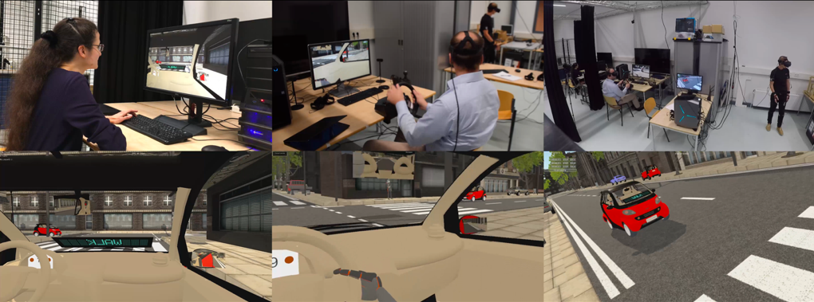](https://www.youtube.com/watch?v=W2VWLYnTYrM)

### Environment
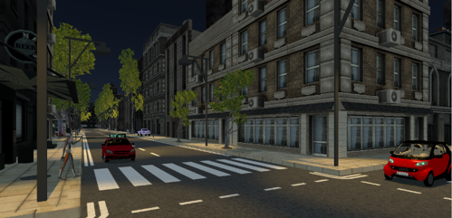

The coupled simulator supports both day and night-time settings. Figure above shows a view of the night mode. Figure below shows the top view of the environment. It is a model of a city centre containing:
- Network of 2-lane roads
- 10 intersections with traffic lights that can be turned on and off before the experiment or programmatically in real-time
- 34 zebra crossings
- Static objects (buildings, parked cars, trees)
- Advertisements (programmable and can be used as visual distractions)

Drivable cars:
- small (similar to Smart Fortwo)
- medium (similar to Pontiac GTO)
- large (similar to Nissan Datsun)

Cars that are not controlled by the human participants can be instructed to follow a trajectory before the experiment or can be programmed to respond to other road users.

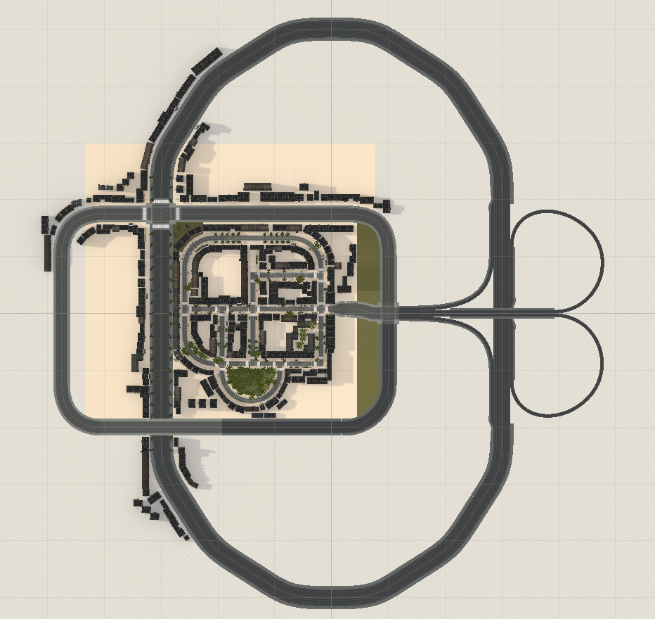

#### Input
The coupled simulator supports a keyboard and a gaming steering wheel as input sources for the driver of the manual car, a keyboard for the passenger of the AV to control the external human-machine interface, and a motion suit for the pedestrian. At the moment, supported motion suit is Xsens Motion Suit.

#### Output
The supported sources of output are a head-mounted display (HMD) and computer screen for the driver, a computer screen for the passenger, and a head-mounted display for the pedestrian. At the moment, supported HDM is Oculus Rift CV1.

#### Networking and data logging
The current number of human participants supported by the coupled simulator is three. However, this number can be expanded up to the number of agents supported by the network. Synchronisation in a local network is handled by a custom-made network manager designed to support the exchange of information between agents with low latency and real-time data logging at 50 Hz for variables from the Unity environment and up to 700Hz from the motion suit. The data that are logged include the three-dimensional position and rotation of the manual car and the AV, the use of blinkers by the driver of the manual car, and 150 position and angular variables from the motion suit. The data are stored in binary format, and the coupled simulator contains a function to convert the saved data into a CSV file. The host agent initiates a red bar that is displayed across all agents for 1 s to allow for visual synchronisation in case screen capture software is used.

## Installation
The simualator was tested on Windows 10 and macOS Mojave. All functionality is supported by both platforms. However, support for input and output devices was tested only on Windows 10.

After checking out this project, launch Unity Hub to run the simulator with the correct version of Unity (currently **2019.3.5f1**).

## How to run
Select the project from the Unity Hub projects list. Wait until the project loads in. If it is not in the Unity Hub list (it is the first time you are running the project), it has to be added first - click *Add* and select a folder containing the project files.
Once the project is loaded into the Unity editor press the Play button to run it.

To start host press _Start Host_ button. 
To start the client press _Start Client_ button, enter the host IP address and press _Connect_.
Steps to run an experiment:
1. Start host and wait for clients to join if needed.
2. Once all clients have joined, on the host, select one of the experiments listed under _Experiment:_.
3. On the host, assign roles to participants.
4. On both host and clients, each participant has to select control mode.
5. Start an experiment with the _Start Game_ button.

# Instant start parametets
If the user wants to prepare a build that runs simulation instantly with a selected experiment and role, he is able to do so by setting parameters of the InstantStartHostParameters struct. It can be accessed and changed on a _StartScene_ (scene) -> _Managers_ (game object) -> _NetworkingManager_ (component) -> _InstantStartParams_ (field). The struct consists of the following fields:
- _SelectedExperiment_: int variable which indicates a zero-based index of a selected experiment in _Experiments_ list (field in NetworkingManager component).
- _SelectedRole_: int variable which indicates a zero-based index of a selected role in _Roles_ list (field in ExperimentDefinition component) of a selected experiment prefab.
- _SkipSelectionScreen_: boolean variable, that if set to true makes the simulator run (as host) a selected experiment (with a selected role) right after the application is run - skipping experiment and role selection screen.
- _InputMode_: enum variable, that selects the display and controller pair for the instant start build. 
Available values are:
- _Flat_: use a flat-screen to display simulation and mouse&keyboard/gamepad/steering wheel to control it.
- _VR_: use virtual reality headset to display simulation and mouse&keyboard/gamepad/steering wheel to control it.  
- _Suite_: use virtual reality headset to display simulation and XSense suite to control it (only pedestrian avatar).

## Configuration
The central point for configuring the simulator is _Managers_ game object from the _StartScene_ scene. It has two components:
- _PlayerSystem_: gathering references to player avatar prefabs,
- _NetworkingManager_: gathering references to experiment definitions and elements spawned during networked experiment runtime (currently only waypoint-tracking cars - _AICar_).

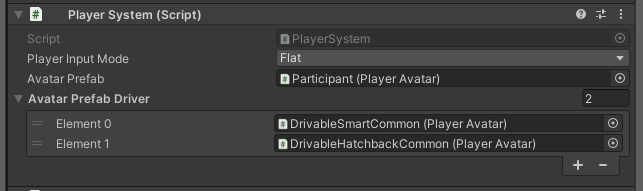

The experiment is defined solely with prefab containing the _ExperimentDefinition_ component in the root object.
To make newly created experiment selectable you have to add its prefab to _Experiments_ list on _NetworkingManager_ component.

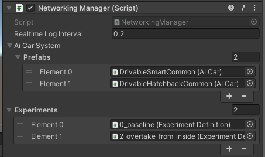

To edit the experiment definition, double click the prefab in the _Project_ window.

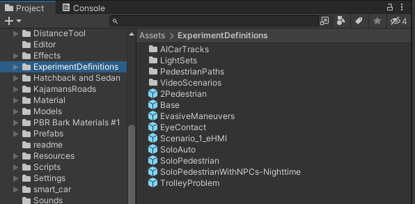

Prefab will be opened in edit mode along with the currently defined _Regular Prefab Editing Environment_. When defining the experiment it is worth setting _Regular Prefab Editing Environment_ variable to the Unity scene defined in the experiment (_Edit -> Project Settings -> Editor -> Prefab Editing Environments -> Regular Environment_).

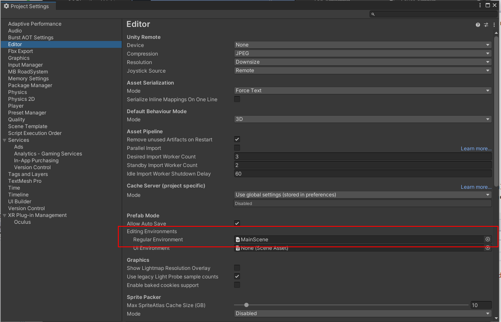

_ExperimentDefinition_ component defines the following fields:
- _Name_: the name of the experiment
- _Scene_: Unity scene name to be loaded as an experiment environment
- _Roles_: list defining roles that can be taken during an experiment by participants
- _Points of Interest_: static points that are logged in experiment logs to be used in the log processing and analysis
- _Car Spawners_: references to game objects spawning non-player controlled cars
- _AI Pedestrians_: defines a list of _PedestrianDesc_ structs that contain a pair of an _AIPedestrian_ (the game object that defines an AI-controlled pedestrian avatar) and _WaypointCircuit_ (defining a path of waypoints for the linked avatar) 

_Points of interest_ is a list of _Transform_ references.
_CarSpawners_ list references game objects containing component inheriting from _CarSpawnerBase_. It defines, with overridden _IEnumerator SpawnCoroutine()_  method, spawn sequence (see _TestSyncedCarSpawner_ for reference implementation). Car prefabs spawned by the coroutine with _AICar Spawn(CarSpawnParams parameters, bool yielding)_ method must be one of the referenced prefabs in _AvatarPrefabDriver_ list on _NetworkManager_ component. 

_Base.prefab_ from _ExperimentDefinitions_ folder is an example experiment definition showcasing simulator features.

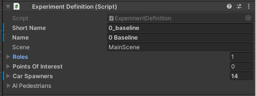

### Configuration of agents
Roles field is a list of _ExperimentRoleDefinition_ struct's defining experiment roles with the following base data fields:
- _Name_: short name/description of the role
- _SpawnPoint.Point_: defines where player avatar will be spawned
- _SpawnPoint.Type_: a type of player avatar. It may be either _Pedestrian_, _Driver_, _Passenger_ of an autonomous car.

#### Adding and removing agents
To add a new agent either increase the size of Roles array or duplicate existing role by right-clicking on the role name and selecting Duplicate from the context menu.

To remove the agent right click on the role name and select Delete from the context menu or decrease the list size removing end entries that don't fit the resized list.

#### Configuration of starting location of agents
Add a new game object to the prefab and set its position and rotation.
Drag the newly created object to the _SpawnPoint.Point_ in role definition.

### Agent camera configuration
Additionally to the location, camera settings can be provided for a spawned agent.
_CameraSetup_ component allows doing that. It should be added to the game object that represents a position where the avatar will be spawned (the one defined in _ExperimentDefinition_ (component) -> _Roles_ (list field) -> role entry on the list -> _SpawnPoint_ (struct) -> _Point_ (field)).
The component exposes two fields:
- _FieldOfView_: value which is set at spawn-time to _Camera.fieldOfView_ property.
- _Rotation_: value which is set at spawn-time to _Transform.localRotation_ of a game object hosting _Camera_ component.
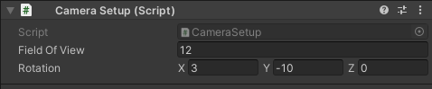

#### Configuration of the pedestrian agent
No additional configuration is needed for pedestrian type agents.

#### Configuration of the driver agent
For _Driver_ role following field has to be defined:
- _CarIdx_ - points to a car prefab on the _AvatarPrefabDriver_ (field on _PlayerSystem_ component) list that will be spawned for this role. 

#### Configuration of the passenger agent
For _Passenger_ type of agent following additional fields has to be defined:
- Car Idx - indicates car prefab that will be spawned for this role. Selected prefab is the one on the indicated index on _AvatarPrefabDriver_ list (field on _PlayerSystem_ component)
- _TopHMI_, _WindshieldHMI_, _HoodHMI_ fields - define which HMI prefab to spawn on indicated spots
- _AutonomusPath_ - references game object defining waypoints for the autonomous car via _WaypointCirciut_ component

### Configuration of non-playable characters

Paths that can be followed both by non-playable pedestrians and vehicles are defined with the WaypointCircuit component.
To add waypoint press plus sign and drag waypoint Transform into the newly added field.
To remove waypoint press a minus sign next to the waypoint.
To reorder waypoint click up/down signs next to a waypoint.
To change the position of a waypoint select waypoint transform and move it do the desired position.

#### Configuration of the movement of the non-playable vehicles
Additionally, for vehicles, SpeedSetting along with Collider component might be used to further configure tracked path.
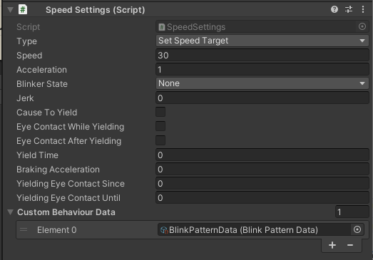

#### Exporting and importing WaypointCircuit's
_WaypointCirciut_ can be serialized into CSV format (semicolon separated) with an _Export to file_ button. The following parameters are serialized:
Game object
- name
- tag
- layer

Transform
- x; y; z - world position
- rotX; rotY; rotZ - world rotation (euler angles)

SpeedSettings
- waypointType
- speed
- acceleration
- jerk
- causeToYield
- lookAtPlayerWhileYielding
- lookAtPlayerAfterYielding
- yieldTime
- brakingAcceleration
- lookAtPedFromSeconds
- lookAtPedToSeconds

BoxCollider
- collider_enabled - component enable state
- isTrigger
- centerX; centerY; centerZ - box collider center
- sizeX; sizeY; sizeZ - box collider size

CSV file can be modified in any external editor and then imported with an _Import from file_ button. Importing files will remove all current waypoint objects and replace them with newly created ones according to the data in the imported CSV file.

### Configuration of driver's eye-contact behavior
Initial eye contact tracking state and base tracking parameters are defined with fields in the _EyeContact_ component.
_EyeContactTracking_ defines the initial (and current at runtime) driver's eye contact behavior while the car is not fully stopped.
- _MinTrackingDistance_ and _MaxTrackingDistance_ define (in meters) the range of distances at which eye contact tracking is possible. Distance is measured between the driver's head position and the pedestrian's root position (ignoring a distance on a vertical axis).
- _MaxHeadRotation_ (in degrees) limits head movement on a vertical axis.
_EyeContact_, if tracking is enabled, selects as the target the closest game object tagged with a _"Pedestrian"_ tag that is within the distance range, if it meets rotation constraint (this constrain is checked when the closest object is already selected).

_EyeContactRigControl_ is a component that consumes tracking target provided by _EyeContact_ component and animates drivers head movement.

Eye contact behavior tracking state can be changed when the car reaches the waypoint. Behavior change is defined by the _SpeedSettings_ - the component embedded on waypoint objects. The following four fields control those changes:
- _EyeContactWhileYielding_: defines how the driver will behave while the car is fully stopped
- _EyeContactAfterYielding_: defines how the driver will behave when the car resumes driving after a full stop. This value simply overwrites the current value of _EyeContact.EyeContactTracking_ if the car has fully stopped.
- _YieldingEyeContactSince_: defines how many seconds need to pass before the driver will make eye contact (starting from the moment the car has fully stopped)
- _YieldingEyeContactUntil_: defines how many seconds need to pass before the driver ceases to maintain eye contact (starting from the moment the car has fully stopped)
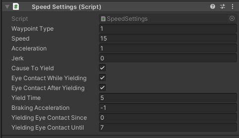

#### Configuration of daylight conditions
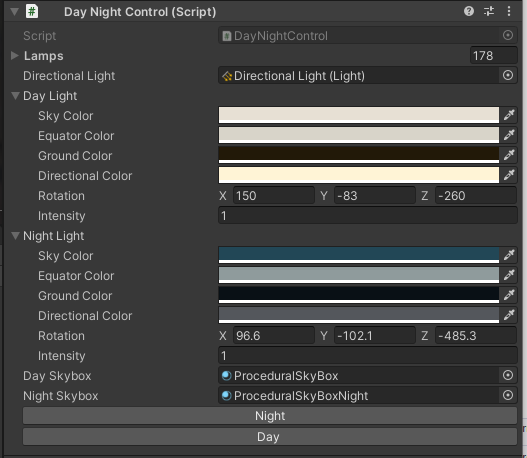

DayNightControl component helps to define different experiment daylight conditions. It gathers lighting-related objects and allows defining two lightings presets - Day and Night, that can be quickly switched for a scene. This component is intended to be used at the experiment definition setup stage. When the development of the environment is complete, it is advised, to save the environment into two separate scenes (with different light setups) and bake lightmaps.

#### Configuration of traffic lights

Creating a traffic street lights system is best started with creating an instance of _ExampleStreetLightCrossSection_ and adjusting it. 
Traffic light sequence is defined in _StreetLightManager_ component as a list of _StreetLightEvents_. Events are processed sequentially. Each event is defined with the following fields:
- _Name_: descriptive name of an event
- _Delta Time_: relative time that has to pass since previous event to activate the event
- _CarSections_: cars traffic light group that the event applies to
- _PedestrianSections_: pedestrian traffic light group that the event applies to
- _State_: state to be set on the lights specified by sections, LOOP_BACK is a special state that restarts the whole sequence

### Details on editing car prefabs
_Speedometer_ component controls a speed indicator. 
To use digital display, set the _Speedometer Text_ field in order to do that.
To use analog display, set the following fields:
- _Pivot_ - the pivot of an arrow
- _PivotMinSpeedAngle_ - the inclination of an arrow for 0 speed
- _PivotMaxSpeedAngle_ - the inclination of an arrow for max speed
- _MaxSpeed_ - max speed displayed on the analog display

## Troubleshooting
### Troubleshooting MVN suit
#### Running the simulation
Connect the Asus Router with the USB Adapter to the PC and plug the Ethernet in a yellow port of the router. Let it boot up for some time while you prepare the software and the suit. Connect the Oculus Rift HDMI and USB 3.0 to the computer.
Plug in the black MVN dongle in a USB 3.0 port of the computer Run the latest version of MVN Analyze. Fill out the anthropometric data and participant name by creating a new recording (1).

Check under _Options -> Preferences -> Miscellaneous -> Network Streamer_ that the data streamer is set to _Unity3D_.

Note: if you find out later on that somehow the avatar looks buggy in Unity, play around with the down sampling skip factor in the _Network Streamer_ overview to improve rendering.

Turn on the Body Pack with all the sensors connected. This will sound like one beep. Wait for 30 seconds and press the WPS button on the router. When the Body Pack of the suit beeps again, continuously press the button for 2 seconds until you hear two sequential beeps. Look if the light of the button becomes a strobe light. If this does not happen within a minute or 5, you’ve got a problem named Windows.

##### The problem named Windows
Delete the following software from the pc and re-install the latest version of MVN Analyze. This will re-install also the bonjour print services.

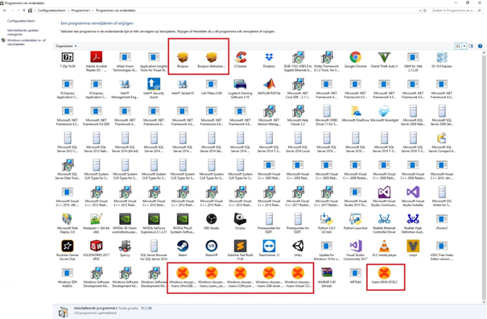
 
##### The post era of having problems with Windows
If you have an avatar in MVN Analyze and all the sensors are working, boot Unity for the simulation. See figure below: press play to launch the simulation, use the dropdown menu to select a participant and press the trial button to launch a trial.

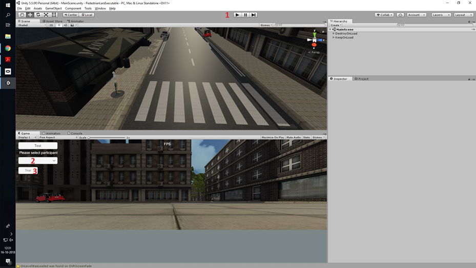

**Note.** If you want to match the orientation of the Oculus to the orientation of the avatar’s head, make sure you have left-clicked the game screen in Unity and press the R-key on your keyboard. Pressing the R-key to match the visuals with the head orientation is an iterative process which requires feedback from the participants.

If you want to start a new trial, click play again at the top of the Unity screen to end the simulation. Also match the head orientations again with the R-key loop.

### Troubleshooting Oculus Rift
Always run Oculus Home software when using Oculus Rift. Otherwise you will encounter black screens. Make sure your graphics driver and USB 3.0 connections are up to date. If Oculus gives a critical hardware error, disconnect Rift and set Oculus Home software to Beta (Public Test Channel, 1st figure below) and check if Oculus Home setting is set to allow Unknown apps (2nd figure below).

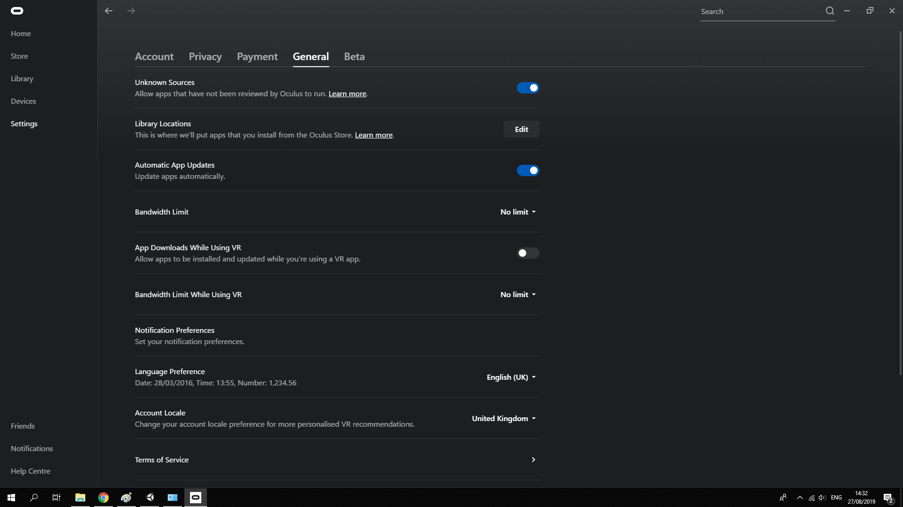

### Troubleshooting connection
The agent PCs need to be connected via a local network. If you cannot reach the host machine, try to ping it.

#### Windows firewall
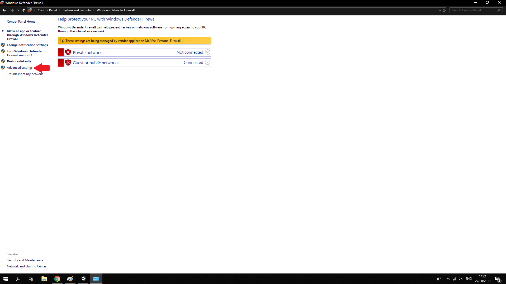

Inbound rules: Set correct Unity Editor version to allow all connections.

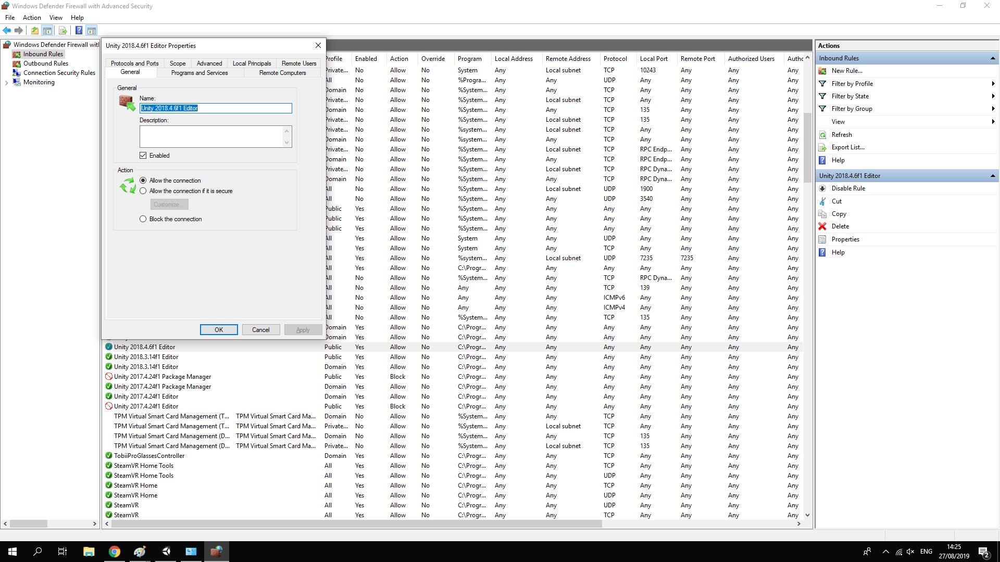

### Troubleshooting steering wheel
Check if supporting software is installed (e.g., Logitech gaming software G27 is used in our case). In Unity, you can check which button corresponds to your specific wheel. You can find this out by using the following asset in an empty project: https://assetstore.unity.com/packages/tools/input-management/controller-tester-43621

Then make sure you assign the correct inputs in Unity under _Edit -> Project Settings -> Input_ (see figure below).

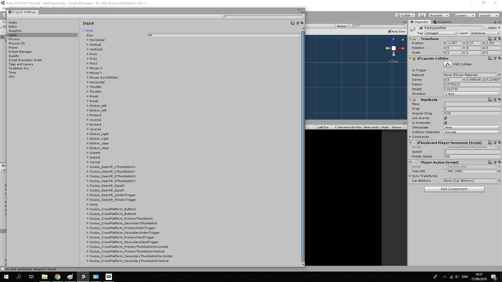

## Used assets
We have used the following free assets:

| Name | Developer | License
| --- | --- | ---
| [ACP](https://github.com/Saarg/Arcade_Car_Physics) | Saarg | MIT
| [Textures](https://cc0textures.com) | Various | Creative Commons CC0
| [Oculus Integration](https://assetstore.unity.com/packages/tools/integration/oculus-integration-82022) | Oculus | Oculus SDK License
| [Simple modular street Kit](https://assetstore.unity.com/packages/3d/environments/urban/simple-modular-street-kit-13811) | Jacek Jankowski | Unity asset
| [Realistic Tree 10](https://assetstore.unity.com/packages/3d/vegetation/trees/realistic-tree-10-54724) | Rakshi Games | Unity asset
| [Small Town America - Streets](https://assetstore.unity.com/packages/3d/small-town-america-streets-free-59759) | MultiFlagStudios | Unity asset
| [Cars Free - Muscle Car Pack](https://assetstore.unity.com/packages/3d/small-town-america-streets-free-59759) | Super Icon LTD | Depricated, Unity asset
| [Mini Cargo Truck](https://assetstore.unity.com/packages/3d/vehicles/land/mini-cargo-truck-68663) | Marcobian Games | Unity asset
| [Street Bench](https://assetstore.unity.com/packages/3d/props/exterior/street-bench-656) | Rakshi Games | Unity asset
| [waste bin](https://assetstore.unity.com/packages/3d/waste-bin-73303) | Lowpoly_Master | Unity asset
| [Smart fortwo](https://grabcad.com/library/smart-fortwo-1) | Filippo Citati | MIT